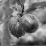
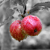

## Task 3.3: Colorfilter With AltiVec

Implement a program, that uses SIMD instructions to process an uncompressed pixel graphic stored with [BMPv5 file header](https://msdn.microsoft.com/en-us/library/windows/desktop/dd183381(v=vs.85).aspx) and RGBA-pixel data. We provide you with [skeleton code](./colorfilter/) to read the bitmap file.

Implement the following tasks with AltiVec:

| Filter | Description                                                    | Example                 |
| ------ | ---------------------------------------------------------------|:----------------------- |
| 1      | Invert all color channels                                      |  |
| 2      | Compute a greyscale image. Do not change alpha values          |  |
| 3      | Turn all pixels grey, where the red is not the _dominat color_ |  |
| 4      | Go crazy, make up your own filter                              |  |

_Hint_: Greyscale is roughly speaking the average of a pixels RGB-values, [assigned to all channels](https://en.wikipedia.org/wiki/Grayscale#Grayscale_as_single_channels_of_multichannel_color_images). However, the human eye perceives each color with a different brightness. Thus, a more favorable approach is a weighted average, e.g.  with one of the [following coefficents](https://en.wikipedia.org/wiki/HSL_and_HSV#Lightness). Different coefficients lead to different results, but some might be more efficiently implemented.

### Input / Output

Your program receives the selected filter and an input image as command line arguments. It has to return with exit code 0 and produces a 4-channel BMPv5 file called `output.bmp`.

#### Example call with filter 1 (invert):

    ./colorfilter 1 apples.bmp
