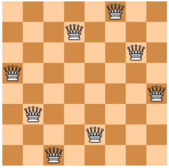

# ParProg20 Assignment 5

*Submission deadline: 2020-07-25, 23:59 CEST*

This assignment covers programming for shared-nothing systems with the Message Passing Interface (MPI) and Actors using Erlang. 

For the MPI tasks, your Makefile has to compile your sources with `mpicc`/`mpic++`. We recommend the [Open MPI](https://www.open-mpi.org/) or [MPICH](https://www.mpich.org/) implementations, which are available on most Unix distributions. The validation system uses Open MPI. For the Actor tasks, your Makefile has to compile your sources using `erlc`.

## General Rules

Your solutions have to be submitted at https://osm.hpi.de/submit/.

Our automated submission system is intended to give you feedback about the validity of your file upload. A submission is considered as accepted if the following rules are fulfilled:
* You did not miss the deadline.
* Your file upload can be decompressed with a zip / tar decompression tool.
* Your submitted solution contains only the source code files and a Makefile for Linux. Please leave out any Git clones, backup files or compiled executables.
* Your solution can be compiled using the `make` command, without entering a separate sub-directory after decompression.
* You program runs without expecting any kind of keyboard input or GUI interaction.
* **Our assignment-specific validation script accepts your program output / generated files.**

If something is wrong, you will be informed via email (console output, error code). Re-uploads of corrected solutions are possible until the deadline.

In order to pass each assignment **50% must be solved correctly**. Documentation should be done inside the source code.

Submit your solutions as team of three persons.

## Task 5.1: Heatmap With MPI

Implement a program that simulates heat distribution on a two-dimensional field. The simulation is executed in rounds. The field is divided into equal-sized blocks. Initially some of the blocks are cold (value=0), some other blocks are active hot spots (value=1). The heat from the hot spots then transfers to the neighbor blocks in each of the rounds, which changes their temperature value. 

The new value for each block per round is computed by getting the values of the eight direct neighbor blocks from the last round. The new block value is the average of these values and the own block value from the last round. Blocks on the edges of the field have neighbor blocks outside of the fields, which should be considered to have the value 0. When all block values are computed in a round, the value of the hot spot fields may be set to 1 again, depending on the live time of the hot spot during a given number of rounds. 

Develop a parallel application for this simulation in C / C++ using MPI. The goal is to minimize the execution time of the complete simulation. Specific optimizations for the given test hardware are not allowed, since we may run your code on some larger system for the performance comparison.

### Input

Your executable named `heatmap` accepts five parameters:
* The width of the field in number of blocks.
* The height of the field in number of blocks.
* The number of rounds to be simulated.
* The name of a file (in the same directory) describing the hotspots.
* Optional parameter: The name of a file (in the same directory) containing coordinates. If it is passed, only the values at the indicated coordinates (starting at (0, 0) in the upper left corner) are to be written to the output file.

#### Example calls:
    mpirun -np 16 ./heatmap 20 7 17 hotspots.csv
	mpirun -np 16 ./heatmap 20 7 17 hotspots.csv coords.csv

The hotspots file has the following structure:
* The first line can be ignored.
* All following lines describe one hotspot per line. The first two values indicate the position in the heat field (x, y). The hot spot is active from a start round (inclusive), which is indicated by the third value, to an end round (exclusive!), that is indicated by the last value of the line.

| Example hotspots.csv      | Example coords.csv |
| ------------------------- | ------------------ |
| `x,y,startround,endround` | `x,y`              |
| `5,2,0,20`                | `5,2`              |
| `15,5,5,15`               | `10,5`             |

### Output

The program must terminate with exit code 0 and has to produce an output file with the name `output.txt` in the same directory.

If your program was called without a coordinate file, then this file represents the resulting field after the simulation terminated. Each value in the field is encoded the following way:
* A block with a value larger than 0.9 has to be represented as `X`. 
* All other values must be incremented by 0.09. From the resulting value, the first digit after the decimal point is written to the output file.

## Task 5.2: MPI Collective

Implement a parallel MPI program that computes the `double`-precision average of `int` and `double` input values at the same time.

You can directly read the `double` values from the input file. The `int` values are computed by converting the `double` values with `floor()` and casting them to `int`.

Your program may only use collective MPI operations to coordinate the parallel computation. `MPI_Send` and `MPI_Receive` (and their variations) are disallowed.

### Input

Your executable named `mpiavg` and accepts three parameters:
* The file name of a text file with the input values, one `double` per line.
* The number of MPI ranks to be used for the `int`-precision average computation.
* The number of MPI ranks to be used for the `double`-precision average computation.

#### Example call:

    mpirun -np 16 ./mpiavg data.txt 7 9	

#### Example content of `data.txt`:

    5.666
    4.3234
    7.3434
    2.434
    1.0

### Output

The program must terminate with exit code 0 and print two `double` numbers: first the integer- precision average, and then the double-precision average (with a 6 digit precision).

    3.800000
    4.153360

Your solution is considered as correct if you use as many ranks as given by the arguments (unless your input is too small).
We will evaluate your solution with different input lengths and rank counts. Your application needs to produce correct results with all possible configurations. 

## Task 5.3: N-Queens with Actors

Implement an [N-Queens](https://en.wikipedia.org/wiki/Eight_queens_puzzle) solver using parallel Actors in Erlang. Your program has to calculate the number of ways to arrange `N` non-attacking queens on an `N x N` board. In a valid solution, no two queens can occupy the same column, row, or diagonal.

For a regular 8x8-chessboard there are 92 distinct solutions. This is one of them:

### Input

Your compiled main module must be called `nqueens.beam` and export a function `main/1`, that reads the number of queens from the list of command line arguments. 
Also export `nqueens/1`, that receives `N` as an integer and does the actual computation.

The board dimensions are chosen to match the number of queens.

### Output

Your program must terminate with exit code 0 and print the number of valid distinct solutions to the N-Queens problem for the given `N`.

#### Example call: 

    $ erl -noshell -s init stop -run nqueens main 8
    92

